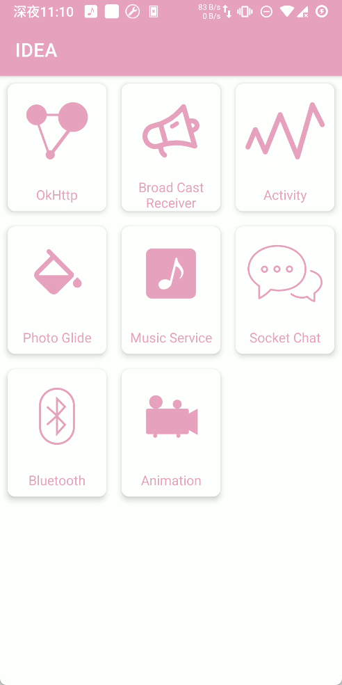
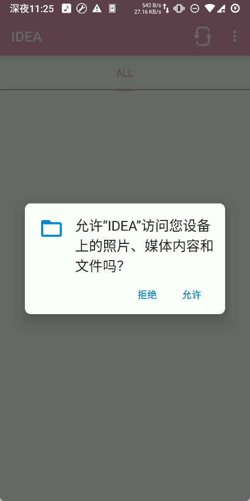
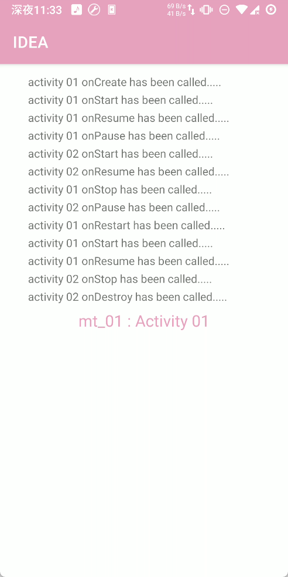
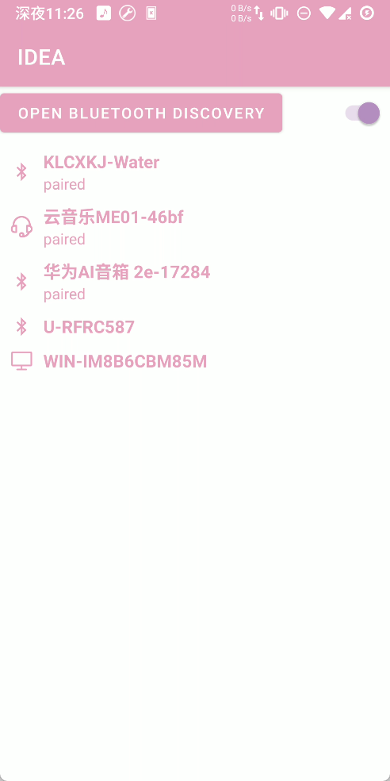
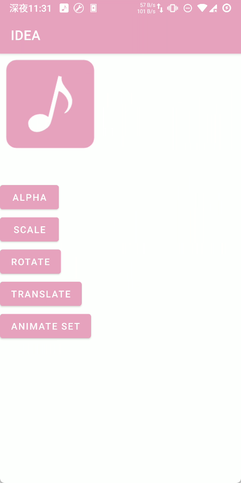

# Android Idea
> 用于个人学习归纳

涉及到的第三方库
```groovy
implementation ('com.github.li-xiaojun:XPopup:2.9.4'){
    exclude group: "com.davemorrissey.labs", module: "subsampling-scale-image-view-androidx"
}

implementation 'com.squareup.retrofit2:retrofit:2.9.0'
implementation ("com.squareup.retrofit2:converter-gson:$retrofit_version")

implementation "com.github.bumptech.glide:glide:4.15.1"

implementation "com.github.MikeOrtiz:TouchImageView:3.3" // Android X

implementation 'com.github.princekin-f:EasyFloat:2.0.4'


implementation project(path: ':jsonviewer') // com.yuyh.jsonviewer.library.jsonview
```

1. 使用了 OkHttp 作为Idea 的第一步

   > 涉及到 **OkHttp** 的基本使用

2. 使用了 BroadCastReceiver

   > 涉及广播接收、广播发送

3. 新建一个Activity 并监听了其生命周期 作出弹窗以显示，更直观的看到 Activity 【A->B】

   > 使用 EasyFloat 作为浮动窗口 展示Activity 的生命周期的变化

4. Photo Glide : 使用到了 Glide 作为图片加载库

   > 使用了 其基本用法，并配合Recyclerview、Touch View、ViewPager 进行界面展示

5. Music Service ： 总结Service 的使用过程，其中使用到了 AIDL 

   > 其中涉及到了AIDL、Service、Notification、MediaPlayer 的使用

6. Chat ： 进入可以在局域网内进行聊天通信

   > 涉及Socket、ServerSocket 、Executor 多线程的使用

7. Bluetooth : 初步的使用一下蓝牙，实现蓝牙打开/关闭，查找已经配对、已经连接、未连接蓝牙

8. Animation：几种android原生的几种补间动画


## 截图

| -                        | -                      | -                     |                       |
| ------------------------ | ---------------------- | --------------------- | --------------------- |
|      |  |  |  |
|  |  |    |   |


##  下载

 [下载地址](https://github.com/jonesruner/android_idea/releases/download/Debug/app-debug.apk)


